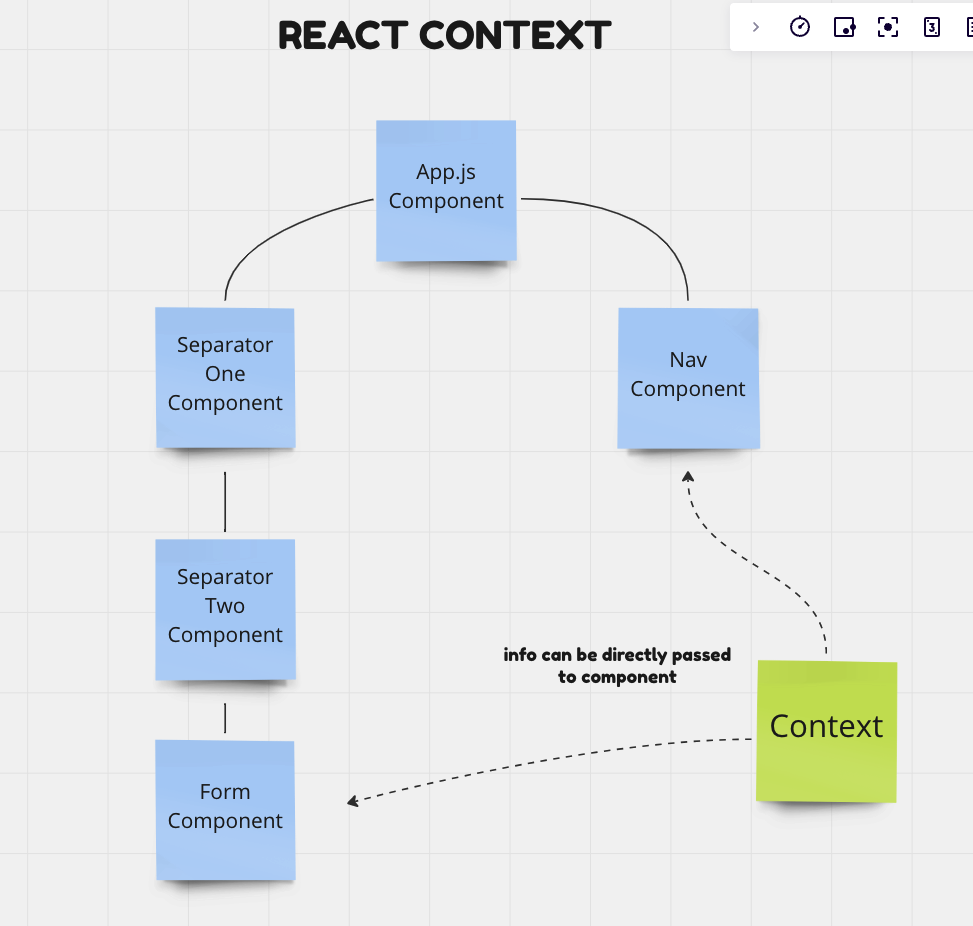

# React Context

This application uses React Context to change the language of a nested Form Component and a non-nested Nav Component from english to french and vice versa.

The code in this repo has many comments. Use them to increase your understanding of Context

Steps to Create Context:

1. Create a `context` directory and a file for the context, custom hook etc.
1. Create the context using `createContext` from `react`
1. Create a custom hook for the consumer using `useContext` and the name of the context you created
1. Create a custom wrapper Provider component using the .Provider method on the created context where you will house your data, state, functions whatever you choose to allow to be consumed
1. Wrap your whole application `<App />` using the wrapper Provider component
1. Use your custom hook to consume the data in whichever component you choose.

Good Luck!

## Video

- [React Context Part 1 - Provide](https://drive.google.com/file/d/1wpP9oCQMLUIZzwhtvdH2DNlnLvxRcAWi/view?usp=sharing)
- [React Context Part 2 - Consume](https://drive.google.com/file/d/1anXf0QlbcvzeVpBcEQhsZHr7olRPGnCN/view?usp=sharing)

